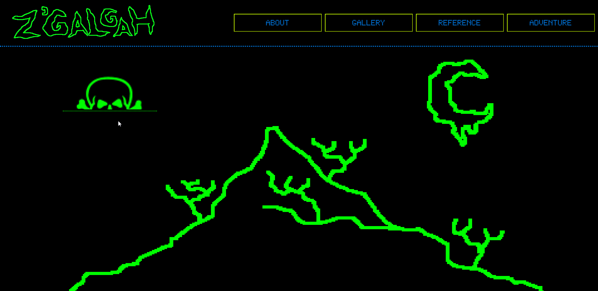

# Z'Galgah

## Description

A single-page website built with React.js / Hooks, developed in 6 days as a final project for Spiced Academy, Berlin (12-week full-stack web development bootcamp). A homepage for a music project Z'Galgah, with embedded Bandcamp music player, 3 sections (About / Gallery / References), while the core is a **horror themed text adventure game**.

User who finishes the game gets a free download of the album from Bandcamp.

## Siteflow

## Tech

-   React.js including Hooks for manipulating the state of the game component

-   Axios for performing HTTP requests to the server

-   PostgreSQL for storing text adventure data

-   Node.js and Express

-   CSS

## Features

-   Users can listen to the music by the artist, learn about the project, browse the gallery (click on thumbnails for full-size images) and the references (click on thumbnails for a link to referred website).

-   Text adventure is based on an array of objects representing locations.

-   Users can play the game using four actions (GO / OPEN / USE / TAKE) on directions and various objects (door, candle etc.)

-   Users can move through locations and are required to solve different puzzles in order to finish the game.

## Features planned for future implementation

-   Expanding the array of locations and the possible actions, objects and puzzles in the game

-   Implementing a user interface enabling the author to expand the game by manipulating the database

-   Mobile responsiveness
